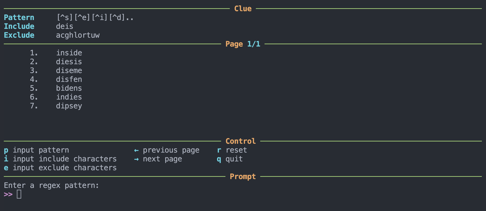

# wordling-solver

A simple terminal UI solver for the word puzzle game **Wordling**.

📱 Play the game: [Wordling: Daily Word Challenge](https://play.google.com/store/apps/details?id=io.digitalsnacks.wordchallenge&hl=zh_TW&pli=1)

## 📷 Screenshot



## 🚀 How to Run

Make sure you have Python and Conda installed. You can create the environment from the provided `environment.yml` file:

```bash
conda env create -f environment.yml
conda activate wordling
python3 solver.py
```
